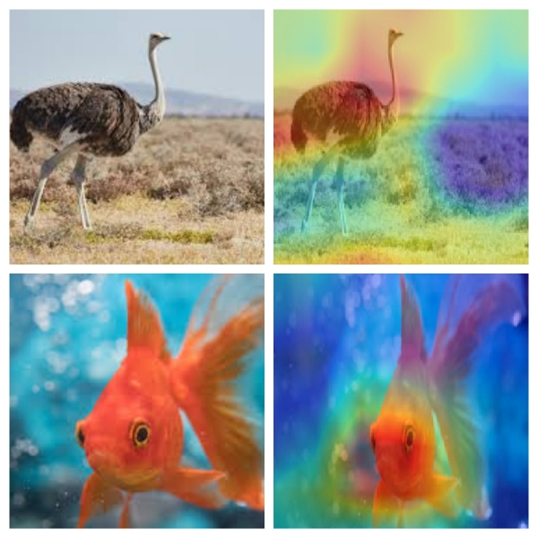

# Class-Activation-Mappings
Chainer implementation of <a href=http://cnnlocalization.csail.mit.edu/Zhou_Learning_Deep_Features_CVPR_2016_paper.pdf>Learning Deep Features for Discriminative Localization</a>

This implementation uses ResNet50 architecture to infer the class activations.


Class activation maps are a simple technique to get the discriminative image regions used by a CNN to identify a specific class in the image. In other words, a class activation map (CAM) lets us see which regions in the image were relevant to this class. The authors of the paper show that this also allows re-using classifiers for getting good localization results, even when training without bounding box coordinates data. This also shows how deep learning networks already have some kind of a built in attention mechanism.This should be useful for debugging the decision process in classification networks.


## Dependencies
* [`Chainer`](https://chainer.org/)
* [`ChainerCV`](https://github.com/chainer/chainercv)
* [`Numpy`](http://www.numpy.org/)

## To run

Trained Chainer model for ResNet50 is stored in `model`.
To test,
  ```shell
python main.py -i <path-to-image>
```
